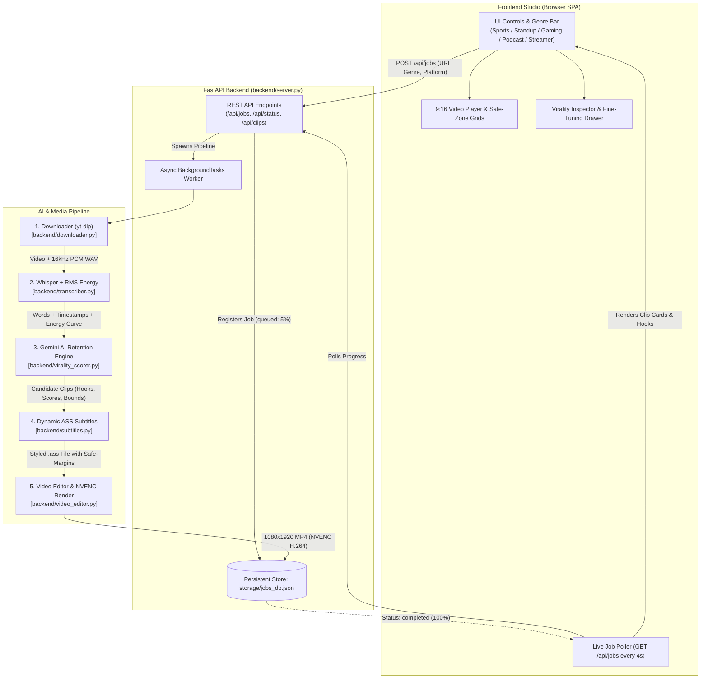

# ClipForge Studio PRO 🎬⚡

<div align="center">


**Automated AI Short-Form Video Clipper & Viral Retention Engine**  
*Transform long-form YouTube videos, podcasts, sports matches, standup specials, and gaming streams into high-converting 9:16 vertical clips for Instagram Reels, TikTok, and YouTube Shorts.*

[Key Features](#-key-features) • [Architecture](#-system-architecture) • [Platform Specs](#-platform-encoding-profiles) • [Quick Start](#-quick-start) • [API Reference](#-api-reference) • [Studio Guide](#-interactive-studio-guide)

</div>

---

## 🌟 Key Features

### 1. 🎯 Niche-Specific AI Genre Tuning
Directs **Google Gemini** retention analysis with genre-specific prompts designed around how audiences consume different formats:
- ⚽ **Sports**: Detects electric goals, buzzer-beaters, defensive saves, VAR controversy, commentary volume spikes, and crowd noise explosions.
- 🎭 **Standup Comedy**: Identifies tight setup-to-punchline narrative arcs, misdirection twists, witty crowd-work/heckler roasts, and audience laughter peaks.
- 🎮 **Gaming & Esports**: Captures 1vX clutch moments, sniper flicks, movement escapes, chaotic team comms, and rage quits.
- 🎙️ **Podcast & Deep Talk**: Isolates contrarian life/business wisdom, mind-expanding revelations, taboo subjects, and heated debates.
- 🔥 **Live Streamer**: Extracts creator freakouts, chat roasting, unexpected real-life incidents, and viral stream memes.

### 2. ⚡ The 4 Laws of Short-Form Retention
Every clip candidate is analyzed against modern short-form algorithmic rules:
1. **The 0–3s Hook Gatekeeper**: Eliminates quiet pauses and dead air; guarantees an immediate curiosity gap, shock revelation, or contrarian hot take within the first 1.8 seconds.
2. **Three-Act Narrative Arc (25s–50s)**: Ensures the clip has an engaging setup, escalating tension, and a satisfying punchline or climax before cutoff.
3. **Loopability Pacing**: Prioritizes moments where the final sentence seamlessly loops back into the opening hook to boost completion rates beyond 85%.
4. **Comment-Driving CTAs**: Automatically suggests viral titles, captions, and provocative questions to drive debate in the comment section.

### 3. 🚀 Dual-Engine Hardware Acceleration
- **OpenAI Whisper on CUDA**: GPU-accelerated local transcription with millisecond word-level timestamps and offline acoustic energy profiling (Root-Mean-Square volume curve).
- **NVIDIA NVENC (`h264_nvenc`)**: Sub-second 1080x1920 vertical video rendering with P4 high-quality tuning.
- **Graceful CPU Fallback**: Automatically switches to `libx264` / `libopenh264` if no dedicated NVIDIA GPU is available.
- **Offline Heuristic Fallback**: Operates 100% offline using speech tempo and acoustic volume spikes if no Gemini API key is configured.

### 4. 📸 Instagram Reels Golden Standard Video Profile
- **Target Bitrate**: Calibrated specifically at **4500 kbps (5500 kbps maxrate, 6000 kbps bufsize)** to bypass Instagram’s aggressive server re-compression while maintaining tack-sharp clarity on mobile OLED screens.
- **Color Fidelity**: Enforces Rec.709 color primaries and transfer characteristics (`bt709`) to prevent washed-out colors on iOS and Android.
- **GOP Structure**: Enforces a strict 2-second closed GOP (60 frames @ 30fps) with `+faststart` for zero-buffering mobile playback.

### 5. 🛡️ Platform UI Safe-Zone Shielding
- Automatically calculates `.ass` subtitle margins (`MarginV: 540px`, `MarginR: 150px`, `MarginL: 70px`) so subtitles are never hidden behind Instagram's account handle, caption text, audio marquee, or right-side action buttons.
- **Interactive Safe-Zone Visualizer**: Toggleable simulated Instagram overlay in the web studio to visually verify margin safety before publishing.

### 6. 🎨 Animated Karaoke Subtitles
- Dynamic active-word scaling (`\fscx112\fscy112`) that pops as words are spoken.
- Chunked into bite-sized 2–3 word groupings for rapid mobile reading.
- Live palette switcher (Neon Yellow, Emerald Green, Electric Cyan, Crimson Red).

### 7. 🤖 AI Face-Tracking (`smart_crop`)
- Integrates OpenCV's **YuNet neural face detector** (`face_detection_yunet.onnx`) to dynamically calculate speaker horizontal centers and crop a clean 9:16 vertical frame centered on the active speaker.

---

## 🏗️ System Architecture

### Pipeline Workflow



### The End-to-End Pipeline Stages

| Stage | Name | Progress | Description |
| :---: | :--- | :---: | :--- |
| **0** | **Queued** | `5%` | Job registered in `storage/jobs_db.json`; background worker initiated. |
| **1** | **Downloading** | `15%` | `yt-dlp` extracts high-res source stream; FFmpeg extracts 16kHz mono PCM `.wav`. |
| **2** | **Transcribing** | `35% → 55%` | OpenAI Whisper computes word-level timestamps; audio reader calculates 1.0s RMS energy curve. |
| **3** | **Analyzing** | `65%` | Gemini evaluates 4 Retention Laws with selected genre directives to pick top viral moments. |
| **4** | **Rendering** | `75% → 98%` | Subtitles generated with safe margins; NVENC renders vertical 9:16 video with face-crop/blur. |
| **5** | **Completed** | `100%` | Clips ready for live preview, interactive fine-tuning, and 1-click MP4 export. |

---

## ⚡ Platform Encoding Profiles

| Platform | Target Bitrate | Max Bitrate | Buffer Size | FPS | GOP | Color Space | Subtitle Safe Margin |
| :--- | :---: | :---: | :---: | :---: | :---: | :---: | :--- |
| **Instagram Reels** *(Default)* | **4500 kbps** | **5500 kbps** | **6000 kbps** | **30** | **60** | **BT.709** | `MarginV: 540` / `MarginR: 150` |
| **TikTok** | 5500 kbps | 6500 kbps | 8000 kbps | 30 | 60 | BT.709 | `MarginV: 490` / `MarginR: 130` |
| **YouTube Shorts** | 8000 kbps | 10000 kbps | 12000 kbps | 30 | 60 | BT.709 | `MarginV: 460` / `MarginR: 110` |

---

## 📂 Codebase Structure

```
Clipping/
├── backend/
│   ├── __init__.py
│   ├── config.py                 # Hardware detection, paths, platform bitrates
│   ├── downloader.py             # yt-dlp wrapper, URL normalization, PCM audio extraction
│   ├── face_detection_yunet.onnx # Neural face detection model for smart cropping
│   ├── server.py                 # FastAPI app, background task queue, REST API endpoints
│   ├── subtitles.py              # ASS subtitle generator with karaoke word-popping
│   ├── transcriber.py            # Whisper speech-to-text + RMS energy timeline calculator
│   ├── video_editor.py           # FFmpeg NVENC 9:16 compositor & OpenCV YuNet tracking
│   └── virality_scorer.py        # Gemini Flash AI retention engine + heuristic fallback
├── frontend/
│   ├── app.js                    # SPA state management, API polling, video deck controls
│   ├── index.html                # Studio layout, iPhone preview deck, inspector drawers
│   └── styles.css                # Dark glassmorphic styling, animations, safe-zone grids
├── storage/
│   ├── clips/                    # Rendered 9:16 MP4 clips and .ass subtitle tracks
│   ├── downloads/                # Downloaded source videos and extracted .wav files
│   ├── exports/                  # Final exported MP4 packages
│   └── jobs_db.json              # Persistent job & clip metadata storage
├── run.sh                        # Automated startup script (venv, dependencies, uvicorn)
├── requirements.txt              # Python package dependencies
└── README.md                     # Documentation
```

---

## 💻 Hardware Requirements

### Recommended (GPU Accelerated)
- **GPU**: NVIDIA RTX 20/30/40 Series or GTX 1660+ (Tested on RTX 3080).
- **Driver**: NVIDIA Driver 535+ with CUDA 12 or 13.
- **VRAM**: 4 GB+ (Whisper `base` requires ~1.5 GB VRAM; NVENC uses dedicated ASIC silicon).
- **FFmpeg**: Compiled with `--enable-nvenc` (`h264_nvenc`).
- **OS**: Linux (Fedora, Ubuntu, Debian, Arch) or Windows 10/11 via WSL2.

### Minimum (CPU Fallback)
- **CPU**: 4 cores / 8 threads (Intel Core i5/i7 or AMD Ryzen 5/7).
- **RAM**: 8 GB RAM.
- **Encoder**: OpenH264 (`libopenh264`) or x264 (`libx264`).

---

## 🚀 Quick Start

### 1. Clone the Repository
```bash
git clone https://github.com/soumil-konar/Clipping.git
cd Clipping
```

### 2. Verify System Dependencies
Check GPU status:
```bash
nvidia-smi
```
Verify FFmpeg has NVIDIA NVENC support:
```bash
ffmpeg -encoders | grep nvenc
# Expected: V....D h264_nvenc NVIDIA NVENC H.264 encoder
```
*(On Fedora: `sudo dnf install ffmpeg ffmpeg-free-devel`; On Ubuntu: `sudo apt install ffmpeg`)*

### 3. Launch the Server
Simply run the automated startup script:
```bash
chmod +x run.sh
./run.sh
```
`run.sh` will:
1. Create a Python virtual environment (`.venv`) if one doesn't exist.
2. Install all required dependencies from `requirements.txt`.
3. Start the FastAPI server on `http://localhost:8000` with hot reloading.

*Alternatively, manual launch:*
```bash
python3 -m venv .venv
source .venv/bin/activate
pip install -r requirements.txt
python3 -m uvicorn backend.server:app --host 0.0.0.0 --port 8000 --reload
```

### 4. Configure Gemini API Key (Optional)
The system operates offline using acoustic heuristics. To unlock Gemini Flash AI retention analysis:
1. Get a free API key from [Google AI Studio](https://aistudio.google.com/app/apikey).
2. Save it in a `.env` file in the project root:
   ```bash
   echo "GEMINI_API_KEY=your_api_key_here" >> .env
   ```
   *(Or click the ⚙️ **Settings** button in the web studio header).*

---

## 🎬 Interactive Studio Guide

1. **Open Studio**: Visit `http://localhost:8000` in your browser.
2. **Paste Stream URL**: Enter any YouTube, Twitch, or Kick link.
3. **Select Genre Tuning**:
   - Click `⚽ Sports`, `🎭 Standup Comedy`, `🎮 Gaming`, `🎙️ Podcast`, or `🔥 Live Streamer`.
4. **Choose Framing Mode**:
   - **Cinematic Blur BG**: 16:9 source centered over blurred, expanded background.
   - **AI Smart Crop**: Tracks speaker faces using YuNet neural face detection.
5. **Generate Clips**: Click **Generate Clips**. Watch real-time progress as the pipeline downloads, transcribes, scores, and renders.
6. **Inspect & Fine-Tune**:
   - Click any clip in the sidebar to load it into the 9:16 iPhone deck.
   - Toggle **Safe Zones** to verify subtitle placement against real Instagram UI buttons.
   - Adjust start and end trim sliders.
   - Switch active subtitle highlight colors (Neon Yellow, Emerald, Cyan, Crimson).
   - Click **🔄 Re-Render Clip** for instant NVENC re-rendering.
7. **Export**: Copy the virality rationale, hashtags, and click **Export & Download MP4**!

---

## 🔌 API Reference

### `POST /api/jobs`
Submit a new video for ingestion and automated clipping.
```json
// Request Body
{
  "url": "https://www.youtube.com/watch?v=example",
  "preset": "standup",
  "layout_mode": "blur_bg",
  "platform": "instagram",
  "target_clips": 4
}

// Response
{
  "job_id": "8f3a1b2c",
  "status": "queued"
}
```

### `GET /api/jobs`
List all jobs with their current status, progress percentage, and generated clips.

### `GET /api/jobs/{job_id}`
Retrieve full details, transcript segments, and clips for a specific job.

### `POST /api/jobs/{job_id}/fine-tune`
Re-render a clip with customized trims, layouts, or subtitle colors.
```json
{
  "start_time": 42.5,
  "end_time": 78.0,
  "layout_mode": "smart_crop",
  "platform": "instagram",
  "highlight_color": "&H00FF00&",
  "subtitles_enabled": true
}
```

### `POST /api/clips/{clip_id}/export`
Packages and exports the final clip to `storage/exports/` for direct download.

### `GET /api/status`
Returns GPU CUDA status, detected hardware encoder, and Gemini API key status.

---

## ⚙️ Configuration Options (`.env`)

| Variable | Default | Description |
| :--- | :---: | :--- |
| `GEMINI_API_KEY` | `""` | Google AI Studio API key for Gemini Flash retention analysis. |
| `USE_CUDA` | `true` | Enables PyTorch CUDA acceleration for Whisper speech recognition. |
| `WHISPER_MODEL` | `base` | Whisper model size (`tiny`, `base`, `small`, `medium`). |
| `VIDEO_CODEC` | `h264_nvenc` | Video encoder (`h264_nvenc` for NVIDIA, falls back to `libx264`). |
| `PORT` | `8000` | Web server listening port. |

---

## 📄 License
Released under the [MIT License](LICENSE). Built by [Soumil Konar](https://github.com/soumil-konar) for creators, short-form editors, and viral clipping networks.
