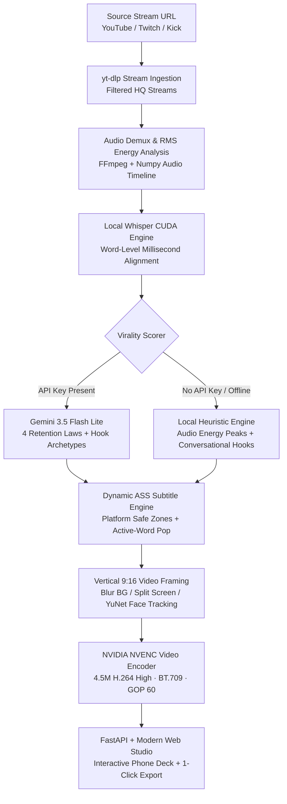

# ClipForge Studio PRO 🎬⚡

> **Automated AI Short-Form Video Clipper & Retention Engine**  
> Transform hours of YouTube, Twitch, and Kick streams into viral, high-retention 9:16 vertical clips for **Instagram Reels**, **TikTok**, and **YouTube Shorts** in seconds. Powered by **OpenAI Whisper (CUDA)**, **Google Gemini 3.5 Flash**, and **NVIDIA NVENC GPU acceleration**.

---

## 🌟 Key Features

- **🚀 NVIDIA GPU Hardware Acceleration**:
  - **CUDA Whisper Transcription**: High-speed, offline speech-to-text with millisecond word-level timestamps using PyTorch & CUDA on NVIDIA RTX GPUs.
  - **NVIDIA NVENC (`h264_nvenc`)**: Sub-second 1080x1920 video renders with high-quality tuning (Preset P4).
  - **CPU Fallback**: Automatic graceful fallback to `libopenh264` / `libx264` if no GPU encoder is detected.

- **🎯 AI Virality & Retention Engine (4 Laws of Short-Form Retention)**:
  - **The 0–3s Hook Gatekeeper**: Eliminates intro filler words and quiet pauses; detects instant hooks (*Curiosity Gap*, *Shock & High Stakes*, *Contrarian Hot Takes*, *Comedy Climax*).
  - **Three-Act Narrative Arc (25s–45s)**: Ensures each clip contains an engaging setup, tension escalation, and a complete resolution/payoff.
  - **Loopability Pacing**: Prioritizes moments where the final sentence seamlessly flows back into the opening hook to boost completion rate (>85%).
  - **Comment-Driving CTAs**: Auto-generates captions with open debate questions (*"Did you think he was going to lose? Drop a comment below 👇"*).
  - **Niche Directives**: Tailored curation for **Live Streamers** (banter & drama), **Podcasts** (contrarian wisdom & deep talk), and **Gaming** (clutch plays & fails).
  - **Dual Engine**: Google Gemini Flash (prioritizing 500 free requests/day on `gemini-3.5-flash-lite`) with automatic local RMS audio-energy heuristic fallback.

- **📸 Instagram Reels Golden Standard Bitrate & Color Profile**:
  - **Bitrate Tuning**: Engineered specifically at **4.5 Mbps target (5.5 Mbps maxrate, 6.0 Mbps bufsize)**. Avoids Instagram's aggressive server-side re-compression artifacts while preserving tack-sharp clarity on mobile screens.
  - **Color Space Fidelity**: Explicit Rec.709 tags (`-color_primaries bt709 -color_trc bt709 -colorspace bt709`) to prevent washed-out colors on iOS and Android OLED displays.
  - **Container Specs**: H.264 High Profile Level 4.2, 30fps, 2-second closed GOP (`-g 60 -keyint_min 30`), and `-movflags +faststart` for instant mobile streaming.

- **🛡️ Platform UI Safe-Zone Protection**:
  - Automatically calculates ASS subtitle margins (`MarginV: 540`, `MarginR: 150` for Instagram Reels) so dynamic karaoke captions are never obscured by bottom account usernames, caption text, audio titles, or right-side action icons (Like, Comment, Share).
  - **Interactive Safe-Zone Checker**: Built-in toggleable simulated Instagram Reels UI in the web studio to visually verify margin safety before publishing.

- **🎨 Modern Web Design Architecture**:
  - Deep midnight glassmorphism (`backdrop-filter: blur(20px)`), ambient glow lighting, and modern typography (**Plus Jakarta Sans** & **JetBrains Mono**).
  - Realistic iPhone 16 Pro preview deck with Dynamic Island.
  - One-click copy for viral titles, captions, and hashtag packs (tailored for `clipping.net` campaigns).

---

## 🏗️ Architecture Pipeline



---

## ⚡ Platform Encoding Profiles

| Platform | Target Bitrate | Max Bitrate | Buffer Size | FPS | GOP | Color Space | Subtitle Safe Margin |
| :--- | :--- | :--- | :--- | :--- | :--- | :--- | :--- |
| **Instagram Reels** *(Recommended)* | **4500 kbps** | **5500 kbps** | **6000 kbps** | **30** | **60** | **BT.709** | **MarginV: 540 / MarginR: 150** |
| **TikTok** | 5500 kbps | 6500 kbps | 8000 kbps | 30 | 60 | BT.709 | MarginV: 490 / MarginR: 130 |
| **YouTube Shorts** | 8000 kbps | 10000 kbps | 12000 kbps | 30 | 60 | BT.709 | MarginV: 460 / MarginR: 110 |

---

## 💻 Hardware & System Requirements

### Recommended (GPU Accelerated)
- **GPU**: NVIDIA GeForce RTX 30-series, 40-series, 20-series, or GTX 1660+ (Tested on RTX 3080).
- **Driver**: NVIDIA Driver 535+ with CUDA 12 or 13.
- **VRAM**: 4GB+ (Base/Small Whisper models require ~2GB VRAM; NVENC uses negligible dedicated ASIC silicon).
- **OS**: Linux (Ubuntu, Fedora, Debian, Arch) or Windows 10/11 via WSL2.
- **FFmpeg**: System FFmpeg compiled with `h264_nvenc` support.

### Minimum (CPU Fallback)
- **CPU**: 4 cores / 8 threads (Intel Core i5/i7 or AMD Ryzen 5/7).
- **RAM**: 8 GB RAM.
- **Encoder**: OpenH264 (`libopenh264`) or x264 (`libx264`).

---

## 🚀 Setup & Installation Guide

### Step 1: Clone the Repository
```bash
git clone https://github.com/soumil-konar/Clipping.git
cd Clipping
```

### Step 2: Verify NVIDIA Drivers & FFmpeg NVENC
Check your NVIDIA GPU status:
```bash
nvidia-smi
```
Verify FFmpeg has NVIDIA NVENC support:
```bash
ffmpeg -encoders | grep nvenc
# Expected output: V....D h264_nvenc NVIDIA NVENC H.264 encoder
```
*(On Fedora/RHEL: `sudo dnf install ffmpeg ffmpeg-free-devel`; On Ubuntu/Debian: `sudo apt install ffmpeg`)*

### Step 3: Set Up Python Virtual Environment
Python 3.10 to 3.14 is supported. Run the automated startup script:
```bash
chmod +x run.sh
./run.sh
```
`run.sh` will automatically:
1. Create a isolated virtual environment (`.venv`).
2. Upgrade `pip`.
3. Activate the environment.
4. Launch the FastAPI server at `http://localhost:8000`.

*Alternatively, manual setup:*
```bash
python3 -m venv .venv
source .venv/bin/activate
pip install -r requirements.txt
python3 -m uvicorn backend.server:app --host 0.0.0.0 --port 8000 --reload
```

### Step 4: Configure Gemini API Key (Optional Free Tier)
ClipForge Studio works 100% offline using local audio-energy heuristics. To unlock Gemini Flash hook detection:
1. Get a free API key from [Google AI Studio](https://aistudio.google.com/app/apikey).
2. Save it directly in `.env`:
   ```bash
   echo "GEMINI_API_KEY=your_gemini_key_here" >> .env
   ```
   *(Or click **Settings** in the web studio and paste your key).*

---

## 🎬 How to Use

1. **Open Studio**: Navigate to `http://localhost:8000` in any modern web browser (Chrome, Brave, Firefox, Edge).
2. **Input Stream**: Paste a live stream or VOD URL from YouTube, Twitch, or Kick.
3. **Select Platform Target**: Choose **Instagram Reels (4.5M)**, **TikTok**, or **YouTube Shorts**.
4. **Choose Content Niche**: Select **Streamer / Live Drama**, **Podcast / Deep Talk**, or **Gaming / Clutch Plays**.
5. **Select Framing**:
   - **Cinematic Blur BG**: Scales original 16:9 video centered over a rich blurred background.
   - **Streamer Split (Cam + Game)**: Top camera close-up with gameplay below.
   - **AI Face-Tracking (YuNet)**: Intelligent horizontal camera panning tracking speaker faces.
6. **Extract Clips**: Click **Extract Viral Clips**.
7. **Curate & Verify**:
   - Review 9:16 vertical playback in the iPhone 16 Pro deck.
   - Click **👁️ Show Instagram UI Safe-Zone** to verify subtitles do not collide with Instagram's overlay.
   - Fine-tune start and end timestamps with the precision stepper.
   - Change active-word karaoke highlight colors (Neon Yellow, Emerald, Cyan, Crimson).
   - Click **🔄 Apply Adjustments & Re-render** for instantaneous NVENC re-renders.
8. **One-Click Export**: Copy the generated title, caption with comment CTA, and download the Instagram-ready MP4!

---

## ⚙️ Environment Variables

| Variable | Default | Description |
| :--- | :--- | :--- |
| `GEMINI_API_KEY` | *(None)* | Google AI Studio API key for retention scoring & hook detection. |
| `USE_CUDA` | `true` | Enable PyTorch CUDA acceleration for Whisper. |
| `WHISPER_MODEL` | `base` | Whisper model size (`tiny`, `base`, `small`, `medium`). |
| `VIDEO_CODEC` | `h264_nvenc` | Hardware encoder (`h264_nvenc` for NVIDIA, fallback to CPU). |
| `PORT` | `8000` | Web server port. |

---

## 🧪 Testing & Verification

Run the full end-to-end verification suite:
```bash
# Test Virality Scorer, Subtitles, and NVENC Video Editor:
.venv/bin/python scratch/verify_all.py

# Test FastAPI Endpoints:
.venv/bin/python scratch/test_api_endpoints.py
```

---

## 📄 License & Credits
Built for creators and clipper networks. Open-source under the MIT License.
